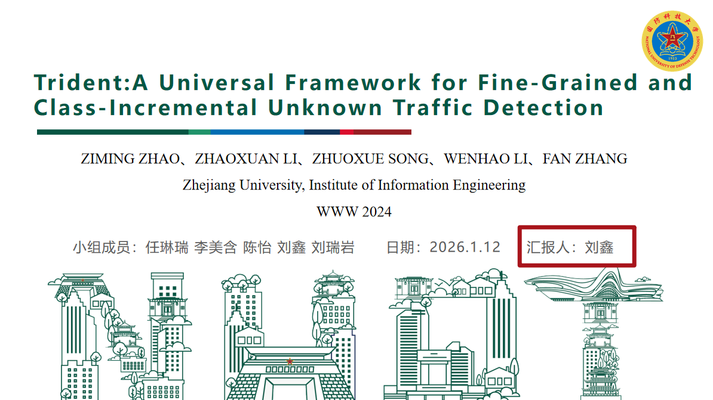

## 复现数据及代码

该仓库内容主要包括Trident框架的复现代码、复现数据集。

> **姓名**：刘鑫  
> **学号**：25026120  
> **代码仓库**：[https://github.com/XinLiu2025/codereproduction](https://github.com/XinLiu2025/codereproduction)
---
## 我的小组贡献概述
1. **主要负责两个模块**。第一，Trident框架的问题定义与威胁模型；第二，Trident框架的核心功能复现；
2.**代表小组成员进行课堂汇报**。（详细汇报了Trident框架的研究背景和动机、NIDS发展现状、Trident框架的核心组成、数据集与实验设置以及实验结果分析）

## 复现模块
我详细阅读了《Trident A Universal Framework for Fine-Grained and Class-Incremental Unknown Traffic Detection》这篇论文，然后针对论文中的核心内容进行了复现，尤其是Trident模块的问题定义及威胁模块，Trident模块的核心组成，完成了相应的文档，可在补充材料中查看，也有相应的复现代码，我上传到了Github仓库，可以在Github链接中查看[https://github.com/XinLiu2025/codereproduction](https://github.com/XinLiu2025/codereproduction)，也可以在补充材料中查看。
## 课堂汇报
我代表我们小组在课堂上进行汇报，在汇报前我和每个人对接完成的内容，然后进行详细准备，顺利完成了课堂上针对复现论文的汇报。

## 补充材料
附件可以查看复现报告和复现代码。